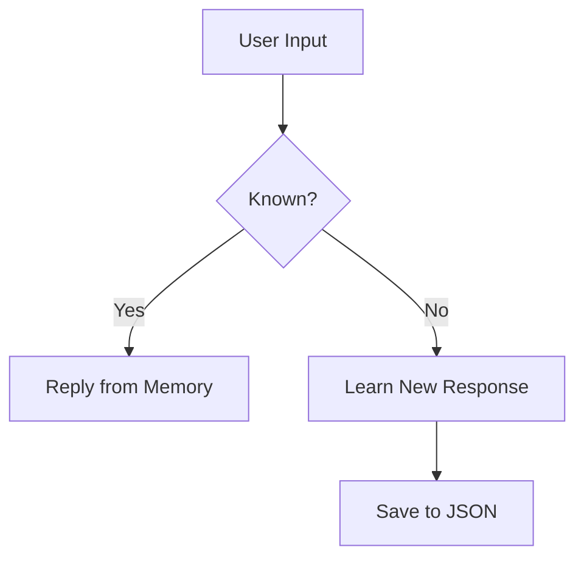
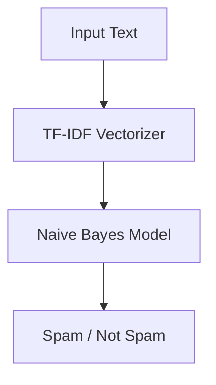

# Hybrid AI chatbot and spam detection system 
<!-- 🔥 HEADER -->
<p align="center">
  
</p>

<!-- 🔥 TYPING ANIMATION -->
<p align="center">
  
</p>

---

# 🧠 PROJECT OVERVIEW

<p align="center">

💀 This project is a combination of:  

🤖 **Self-Learning Chatbot**  
📩 **Spam Detection System**  

⚡ Built using Machine Learning + NLP  

🚀 The chatbot learns from user input  
🔥 The spam model detects real-world spam messages  

</p>

---

# 🎥 PROJECT DEMO

<p align="center">

</p>

---

# ⚙️ FEATURES

<p align="center">

✔ Self-learning chatbot (stores knowledge in JSON)  
✔ Fuzzy matching (smart replies)  
✔ Spam detection using TF-IDF + Naive Bayes  
✔ Train your own dataset  
✔ Interactive CLI interface  

</p>

---

# 🧠 HOW IT WORKS

### 🤖 Chatbot Flow


### 📩 Spam Detection Flow


---

# 🚀 TECH STACK

<p align="center">


<br><br>


</p>

---

# 🛠️ HOW TO RUN

```bash
git clone https://github.com/your-username/your-repo.git
pip install pandas scikit-learn
python main.py
```

---

# 📂 DATASET FORMAT

```csv
text,label
"Win money now","spam"
"Hello friend","ham"
```

---

# 💡 FUTURE IMPROVEMENTS

✔ GUI (Streamlit / Web App)  
✔ Deep Learning Model  
✔ Voice Chatbot  
✔ API Integration  

---

# 🧠 LEARNING OUTCOME

✔ NLP basics  
✔ TF-IDF Vectorization  
✔ Naive Bayes Algorithm  
✔ Model Training  
✔ Real-world AI workflow  

---

<!-- 🔥 FOOTER -->
<p align="center">
  
</p>

---

<h2 align="center">🔥 TRAIN • LEARN • PREDICT • EVOLVE 🔥</h2>
